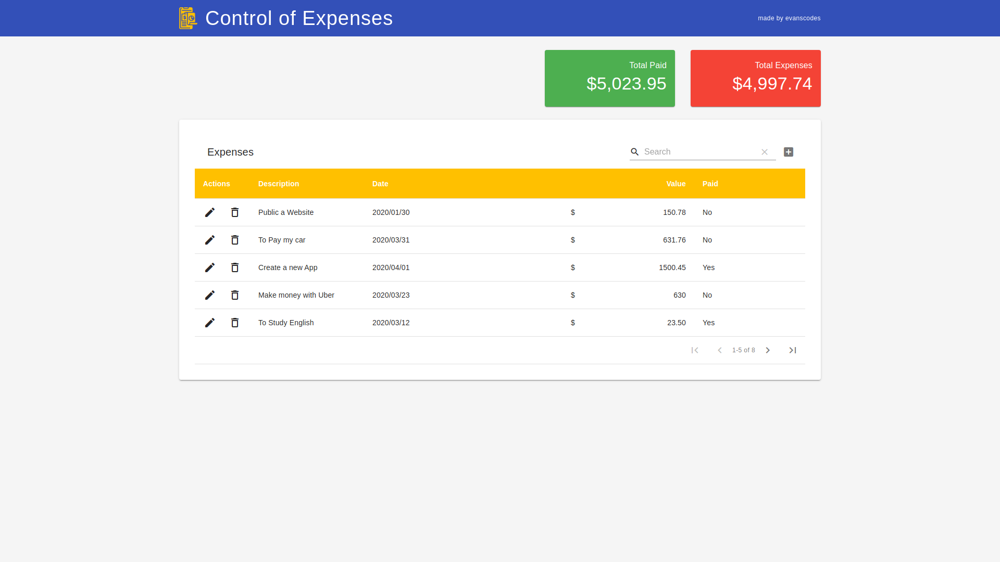

<h1 align="center">

CONTROL OF EXPENSES

</h1>
 
 
  
 
 
 

Project test to at Mobills, a crud made ReactJS + Firebase

  

### Getting started

- In your terminal with the folder frontend opened, run the steps:

> `yarn` or `npm install` **for install the modules**.

> `yarn start` or `npm run start`.

> You can access in your browser the web application http://localhost:3000.

> Online application at **<a href="https://control-of-expenses.web.app/" target="_blank">Control of Expenses</a>**

## Features

[//]: # "Add the features of your project here:"

Features usadas no Projeto.

- **<a href="https://pt-br.reactjs.org/docs/getting-started.html" target="_blank">React Js</a>** — A JavaScript library for building user interfaces

- **<a href="https://firebase.google.com/" target="_blank">Firebase</a>** — Firebase is a Backend-as-a-Service (Baas).

### - LICENSE

This project is licensed under the MIT License - see the <a href="https://opensource.org/licenses/MIT" target="_blank">LICENSE</a> page for details.
